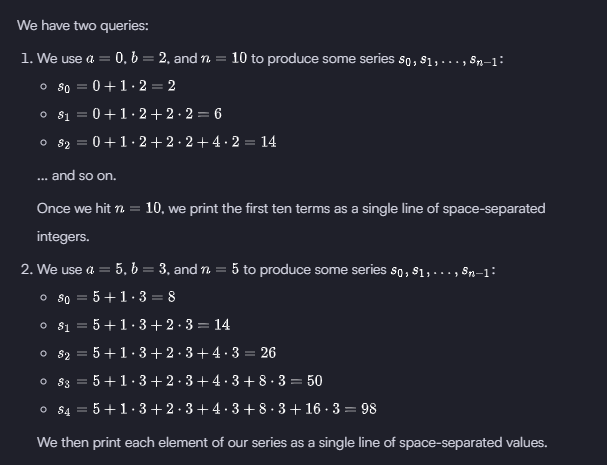

We use the integers , , and  to create the following series:


You are given  queries in the form of , , and . For each query, print the series corresponding to the given , , and  values as a single line of  space-separated integers.

## Input Format

The first line contains an integer, , denoting the number of queries.
Each line  of the  subsequent lines contains three space-separated integers describing the respective , , and  values for that query.

### Constraints


## Output Format

For each query, print the corresponding series on a new line. Each series must be printed in order as a single line of  space-separated integers.

## Sample Input

```java
2
0 2 10
5 3 5
```

## Sample Output

```java
2 6 14 30 62 126 254 510 1022 2046
8 14 26 50 98
```

### Explanation

